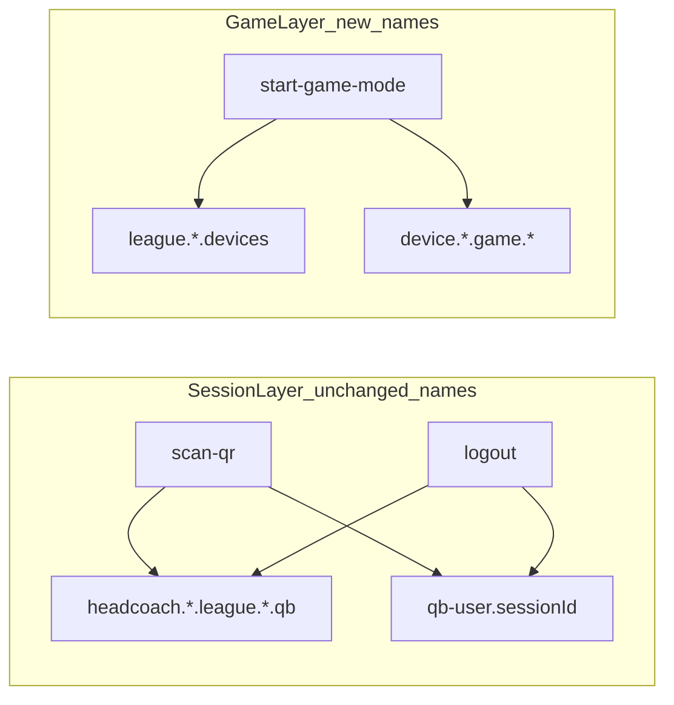
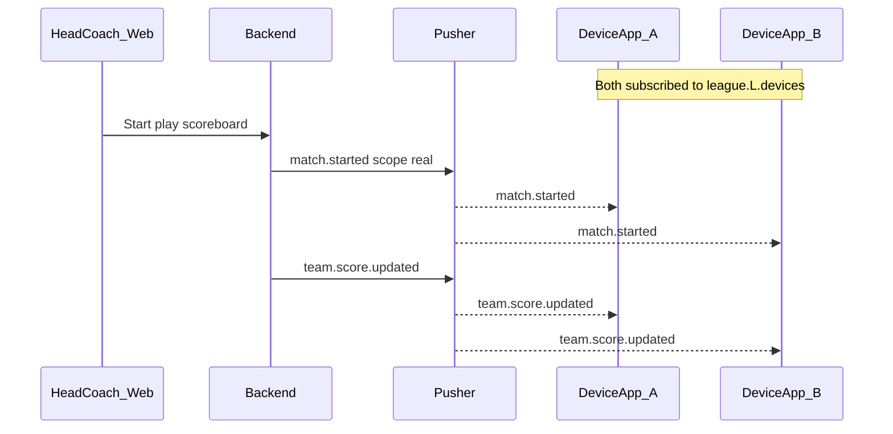
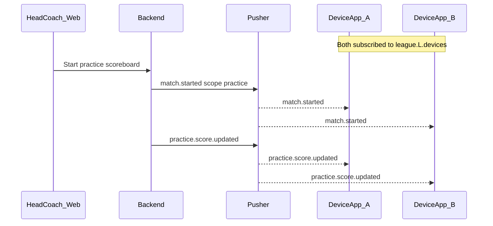
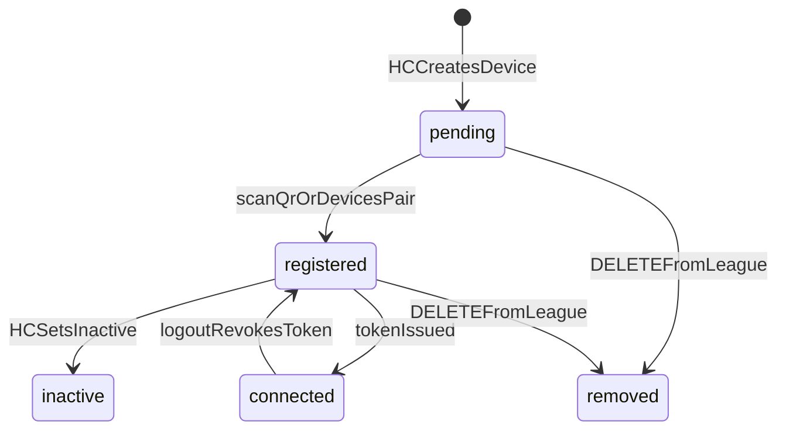
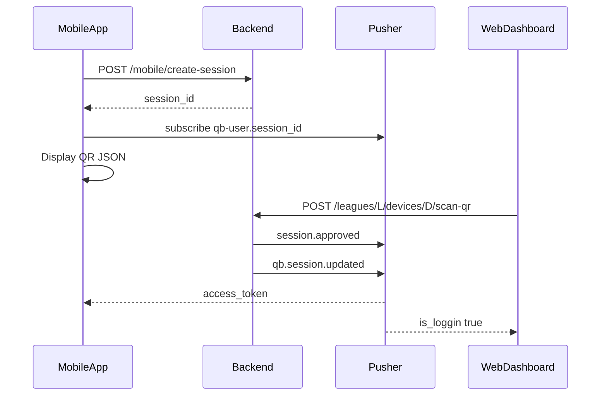
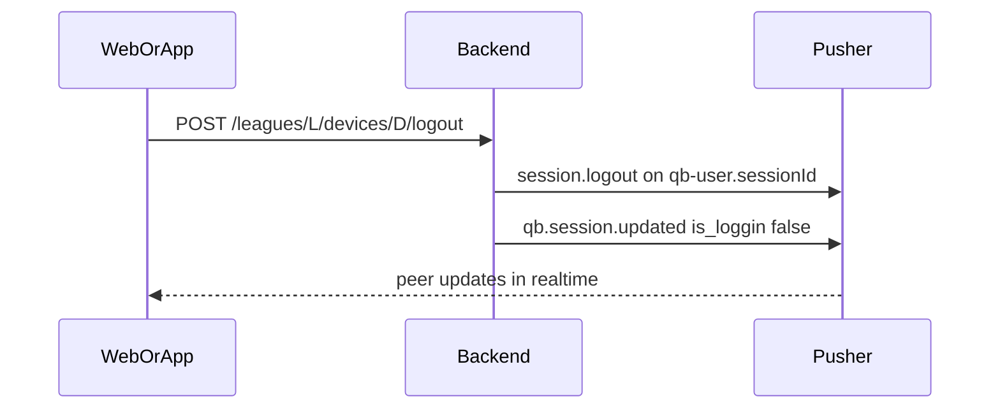

# League Devices

Developer reference for the **League Devices** feature (QB → Device refactor). Covers registration, pairing, session sync, logout, game binding, and in-game realtime broadcasts.

---

## Overview

Each league team used to have a QB modeled as a `User` with role `qb`. That is replaced by a first-class **`Device`** entity:

- Stored in `devices`, linked to leagues via `league_device`
- Authenticates with **Sanctum device tokens** (`HasApiTokens` on `Device`)
- Active games store `play_game_modes.device_id`
- **Session** realtime keeps legacy channel/event names (`.qb`, `qb-user.*`) so clients migrate without a big-bang release
- **In-game** realtime uses new `.devices` channels (see [Why session realtime still uses `.qb` names](#why-session-realtime-still-uses-qb-names))

---

## Migration at a glance

### What changed

| Before | After |
|--------|-------|
| QB `User` per team | `Device` per league (optional `team_id`) |
| `QB-App-Token` on `User` | `Device-App-Token` on `Device` |
| League QB REST under `/teams/{team}/qb` | League device REST under `/devices` |
| Game bound to QB user | Game bound via `play_game_modes.device_id` |
| Poll `qb-session-login-status` while waiting for scan | Pusher `session.approved` on `qb-user.{session_id}` |

**Starting a game vs who receives events (important):**

| Concern | Behaviour |
|---------|-----------|
| **Can the head coach start a match?** | Yes, if the league has **at least one** device with `status = registered`. |
| **Who receives “match started” and league score/play events?** | **Every** registered device in the league that is connected and subscribed to `league.{leagueId}.devices` (e.g. `MatchStarted`, `TeamScoreUpdated`, `PlaySuggested`). |
| **What is `play_game_modes.device_id`?** | One device id is stored on the game row when `POST /start-game-mode` runs (today: the first `registered` device from the query). This is a **primary reference** on the game record, not a limit on who receives league-wide broadcasts. |

So: all league devices should subscribe to `league.{leagueId}.devices` to show match started / live updates on every app. The stored `device_id` does not replace that fan-out.

### API migration (legacy → new)

| Legacy (removed) | New replacement | Notes |
|------------------|-----------------|-------|
| `GET /api/leagues/{league}/qb` | `GET /api/leagues/{league}/devices` | List league devices |
| `POST /api/leagues/{league}/teams/{team}/qb` | `POST /api/leagues/{league}/devices` | Body: `device_name`, optional `team_id` |
| `POST .../teams/{team}/web/scan-qr` | `POST .../devices/{device}/scan-qr` | Same QR flow; `device` id in path |
| `POST .../teams/{team}/qb/logout` | `POST .../devices/{device}/logout` | HC or device token |
| `GET /api/logout-qb-applicaion/{id}` | `POST .../devices/{device}/logout` | App self-logout with device Bearer token |
| `GET /api/qb-session-login-status/{session_id}` | `qb-user.{session_id}` → `.session.approved` | No HTTP polling |
| `POST /api/logout-qb` | `POST .../devices/{device}/logout` | HC-initiated logout |
| QB `User` + `QB-App-Token` | `Device` + `Device-App-Token` | Sanctum on `Device` model |
| Game tied to QB user | `play_game_modes.device_id` | Set on `POST /start-game-mode` |

### Realtime migration (channels + events)

| Concern | Legacy | Devices architecture | Client action |
|---------|--------|----------------------|---------------|
| Web session UI (connected/disconnected) | `headcoach.{hc}.league.{league}.qb` + `.qb.session.updated` | **Same channel + event** | Keep subscription; read `payload.user` as device (see payload mapping) |
| Mobile wait for QR scan | Poll `GET /qb-session-login-status/{session_id}` | `qb-user.{session_id}` + `.session.approved` | **Remove polling**; subscribe before showing QR |
| Mobile / web logout signal | `qb-user.{session_id}` / `qb-logout.{session_id}` + `.session.logout` | **Same** | No change to channel/event names |
| In-game scores (web) | `headcoach.{hc}.qb` and related | `headcoach.{hc}.league.{league}.devices` + `.team.score.updated` | **Subscribe `.devices`** on scoreboards |
| In-game scores / plays (mobile) | User-scoped game channels | `league.{league}.devices` + `device.{deviceId}.game.{gameId}` | **Subscribe with device token** |

### Payload mapping (`user` in `.qb.session.updated`)

The backend maps device fields into the legacy `user` object (`DeviceSessionBroadcaster::legacyWebFields`):

| Event field | Device source |
|-------------|---------------|
| `user.id` | Device primary key |
| `user.name` | `device_name` |
| `user.code` | `pairing_code` |
| `user.is_loggin` | Connected (token active) |
| `user.role` | `"device"` (not `"qb"`) |
| `user.head_coach_id` | Owning head coach |
| `user.league_id` / `team_id` | From league/team association |

---

## Why session realtime still uses `.qb` names

Session connect/disconnect was **intentionally not renamed**. In-game traffic was refactored to `.devices` channels; session pairing was left stable.

1. **Already wired in production clients** - Web League Settings listens on `headcoach.{hc}.league.{league}.qb` for `.qb.session.updated`. Mobile listens on `qb-user.{session_id}` for `.session.approved` / `.session.logout`.
2. **Avoids a coordinated breaking release** - Renaming channels/events would require mobile and web to ship together with the backend.
3. **Payload is device-aware** - Events still use legacy names, but `user` carries device data. Clients update API calls, not necessarily WebSocket listeners.
4. **Partial refactor by design** - New names for gameplay (`league.*.devices`, `device.*.game.*`); old names for session lifecycle only.



A future optional follow-up: broadcast `device.session.updated` on `headcoach.{hc}.league.{league}.devices` in parallel, then deprecate `.qb` session events after all clients migrate.

---

## Client migration checklists

### Web (`coach-vue`)

| Task | Action |
|------|--------|
| Device CRUD | `GET/POST/PUT/DELETE /api/leagues/{league}/devices` (League Settings) |
| Pairing | App shows QR → web **Scan QR** → `POST .../devices/{device}/scan-qr` |
| Session realtime | `private headcoach.{headCoachId}.league.{leagueId}.qb` → listen `.qb.session.updated` - **keep these names** |
| Logout | `POST .../devices/{device}/logout` |
| Remove from league | `DELETE .../devices/{device}` |
| Game start gate | `GET /devices` - require at least one `status === "registered"` before start |
| Scoreboards | `private headcoach.{hc}.league.{league}.devices` → `.team.score.updated` |
| League QB APIs | **Remove all** `/leagues/.../qb` and `/teams/.../qb` usage |

### Mobile app

| Stop using | Start using |
|------------|-------------|
| All League QB endpoints | `/api/leagues/{league}/devices/*`, `/api/devices/me` |
| `GET /api/logout-qb-applicaion/{id}` | `POST /api/leagues/{league}/devices/{device}/logout` (device Bearer token) |
| Poll `GET /api/qb-session-login-status/{session_id}` | Subscribe `qb-user.{session_id}` → `.session.approved` |
| QB user Sanctum token | Device token from `.session.approved` or `POST /api/devices/pair` |
| - | `POST /api/mobile/create-session` before displaying QR |
| - | QR JSON per [QR code contract](#qr-code-contract) below |
| - | In-game: see [Multiple devices - game & practice mode](#multiple-devices--game-mode--practice-mode) |

---

## Multiple devices - game mode & practice mode

This section is the full contract for **every registered device** in a league during an active match. Game mode (play/real) and practice mode use the same league channel but different score events and `match.started` scope.

### Prerequisites (every device app)

Each physical device that should react to a live match must:

1. Be **`registered`** in the league (`league_device` pivot).
2. Be **logged in** - valid device Sanctum token (session active).
3. Subscribe **`private league.{leagueId}.devices`** for **each** `league_id` returned from `GET /api/devices/me` (authenticate via `/broadcasting/auth` with the device token).
4. **Not** rely on legacy QB user channels (`headcoach.{hc}.qb`, `user.{hc}.game.*`) for multi-device behaviour - those were single-QB paths.

Only one head-coach session runs per mode at a time (`play` or `practice`), but **all** subscribed league devices receive the same broadcasts for that session.

### Shared: match start and end

Both modes fire **`MatchStarted`** on:

| Channel | Type | Events |
|---------|------|--------|
| `league.{leagueId}.devices` | Private (device token) | `.match.started`, `.match.ended` |
| `league.{leagueId}` | Presence (web coaches) | same events |
| `league.global` | Presence | same events |

**Payload (listen on mobile via `league.{leagueId}.devices`):**

```json
{
  "league_id": 22,
  "type": "started",
  "scope": "real",
  "scope_detail": {
    "mode": "real",
    "is_play_mode": true,
    "scoreboard": "play",
    "game_id": 105,
    "session_id": null
  },
  "message": "Match has started"
}
```

**How to tell which mode started:**

| Mode | `scope` (legacy string) | `scope_detail.mode` | `scope_detail.is_play_mode` |
|------|-------------------------|---------------------|-----------------------------|
| **Game (play / real)** | `"real"` | `"real"` | `true` |
| **Practice** | `"practice"` | `"practice"` | `false` |

On `.match.started`, mobile should:

1. Read `scope_detail.game_id` (or fetch scoreboard API if you mirror the web).
2. Ignore events for the wrong mode if the app is mode-specific.
3. Optionally subscribe to `device.{deviceId}.game.{gameId}` for play-by-play logs (see below).

On `.match.ended`, tear down game UI and leave game-specific channels.

---

### Game mode (play / real)

When the head coach starts a **game mode** match (`game_mode = play` on `play_game_modes`, scoreboard action `Start` on the play scoreboard).

#### Channels (mobile - device token)

| Channel | Required? | Purpose |
|---------|-----------|---------|
| `league.{leagueId}.devices` | **Yes** | Match start/end, scores, play suggestions |
| `device.{deviceId}.game.{gameId}` | Optional | Play-by-play `.match.log.created` |

#### Events on `league.{leagueId}.devices`

| Event | When | Payload |
|-------|------|---------|
| `.match.started` | Play scoreboard starts | `scope` = `"real"`, `scope_detail.game_id` set |
| `.match.ended` | Play match ends | same shape, `type` = `"ended"` |
| `.team.score.updated` | Team/scoreboard snapshot updated | `score` object |
| `.score.updated` | Detailed score/timer state | `scores` object |
| `.play.suggested` | Suggested play broadcast | `play` object |

#### Optional: play-by-play logs

`MatchLogCreated` broadcasts as **`.match.log.created`** only on:

```text
private device.{deviceId}.game.{gameId}
```

- `{deviceId}` is `play_game_modes.device_id` (one id stored when the game started - not “the only device in the match”).
- Any **registered device in the same league** may authorize for that channel (see `BroadcastChannelAuth::deviceCanAccessGame`).
- This event is **not** duplicated on `league.{leagueId}.devices`. Devices that need logs must subscribe using `game_id` from `.match.started` and the game’s `device_id` (from API or scoreboard response).

#### Web (`coach-vue`) for play mode

- Listens on presence `league.{leagueId}` for `.match.started` with `scope_detail.mode === 'real'`.
- Scoreboards use `headcoach.{hc}.league.{league}.devices` → `.team.score.updated`.

#### Sequence (game mode, two devices)



---

### Practice mode

When the head coach starts a **practice** match (`game_mode = practice`, practice scoreboard `Start`).

#### Channels (mobile - device token)

| Channel | Required? | Purpose |
|---------|-----------|---------|
| `league.{leagueId}.devices` | **Yes** | Match start/end, practice scores, play suggestions |
| `device.{deviceId}.game.{gameId}` | Optional | `.match.log.created` (same rules as play mode) |

#### Events on `league.{leagueId}.devices`

| Event | When | Payload |
|-------|------|---------|
| `.match.started` | Practice scoreboard starts | `scope` = `"practice"`, `scope_detail.mode` = `"practice"`, `is_play_mode` = `false` |
| `.match.ended` | Practice session ends | `type` = `"ended"` |
| `.practice.score.updated` | Practice scoreboard updated | `scores` object |
| `.play.suggested` | Suggested play (when league id resolved) | `play` object |

Practice mode does **not** use `.team.score.updated` or `.score.updated` on the league devices channel - those are play-mode scoreboard events.

#### Web (`coach-vue`) for practice mode

- Listens on presence `league.{leagueId}` for `.match.started` with `scope_detail.mode === 'practice'`.
- Fetches `GET /api/practice-scoreboard?league_id={id}` after start (mobile can use `scope_detail.game_id` directly).

#### Sequence (practice mode, two devices)



---

### Quick reference: which events per mode

| Event | Game (play) mode | Practice mode |
|-------|------------------|---------------|
| `.match.started` / `.match.ended` | Yes (`scope` = `real`) | Yes (`scope` = `practice`) |
| `.team.score.updated` | Yes | No |
| `.score.updated` | Yes | No |
| `.practice.score.updated` | No | Yes |
| `.play.suggested` | Yes (when broadcast) | Yes (when broadcast) |
| `.match.log.created` | Optional on `device.*.game.*` | Optional on `device.*.game.*` |

### Mobile implementation checklist

```
For each league_id in GET /api/devices/me:
  Subscribe private league.{league_id}.devices (device Bearer token)

On .match.started:
  if scope_detail.mode == 'real'     → open game (play) UI, store game_id
  if scope_detail.mode == 'practice' → open practice UI, store game_id
  optionally subscribe device.{primaryDeviceId}.game.{game_id} for logs

On .match.ended:
  Close match UI, unsubscribe game-specific channels

While in play match:
  listen .team.score.updated, .score.updated, .play.suggested

While in practice match:
  listen .practice.score.updated, .play.suggested
```

### What does **not** fan out to all league devices

These stay on coach / user channels only (not `league.*.devices`):

- `coach-group.{hc}.league.{league}` - yardage, system suggestions (`YardageBroadcast`, `HeadCoachSystemSuggestion`)
- `user.{hc}.game.{gameId}` / `user.{hc}.practice.{gameId}` - legacy coach score channels (devices should use `league.*.devices` instead)

---

## Supported pairing flows

1. **Primary - QR (recommended)**  
   Mobile: `create-session` → show QR → subscribe `qb-user.{session_id}`.  
   Web: scan QR → `POST .../devices/{device}/scan-qr`.  
   Mobile receives `.session.approved` with `access_token`.

2. **Alternate - pairing code**  
   `POST /api/devices/pair` with `pairing_code` or `qr_token` (no camera).  
   Returns `token`, `device`, `league_ids`. Fires `.qb.session.updated` on each linked league.

---

## QR code contract

The mobile app displays a QR code encoding **JSON** (not a raw UUID string).

**Required:** one of these keys must hold the `session_id` from `POST /api/mobile/create-session`:

- `session_id` (preferred)
- `userId` (alias accepted by web scanner)
- `id` (alias accepted by web scanner)

**Optional:** `timestamp` (number) - forwarded by web but not required by the API.

**Example payload:**

```json
{
  "session_id": "822fc835-75aa-48bf-8473-354a4913aab2",
  "timestamp": 1718745600
}
```

---

## Device states

| State / flag | Meaning |
|--------------|---------|
| `pending` | Created by head coach; not yet paired |
| `registered` | Paired (`paired_at` set); satisfies game-start check |
| `inactive` | Deactivated by head coach |
| `is_connected` | Runtime: device has at least one valid Sanctum token (live session) |

A device can be `registered` but not `is_connected` after logout (paired before, token revoked).



---

## API reference - Web (head coach)

All routes require **head coach Sanctum token** (`auth:sanctum`). League must belong to the authenticated head coach.

**Base:** `/api/leagues/{league}/devices` - see [API migration](#api-migration-legacy--new) for legacy equivalents.

| Method | Path | Purpose |
|--------|------|---------|
| `GET` | `/` | List devices (`is_connected` included) |
| `POST` | `/` | Create device |
| `PUT` | `/{device}` | Update `device_name`, `team_id`, `status` |
| `DELETE` | `/{device}` | Remove from league (logs out if connected) |
| `POST` | `/{device}/scan-qr` | Scan mobile QR and complete pairing |
| `POST` | `/{device}/logout` | Log out session (revoke token + broadcast) |

### Create device

```http
POST /api/leagues/22/devices
Authorization: Bearer {head_coach_token}
Content-Type: application/json

{
  "device_name": "Sideline Tablet",
  "team_id": 5
}
```

`team_id` is optional; must exist in `league_teams` for that league. Response includes `pairing_code`, `qr_token`, `status: pending`.

### Scan QR (pairing)

```http
POST /api/leagues/22/devices/5/scan-qr
Authorization: Bearer {head_coach_token}
Content-Type: application/json

{
  "session_id": "822fc835-75aa-48bf-8473-354a4913aab2"
}
```

**Response (201):**

```json
{
  "status": 201,
  "message": "Device paired successfully",
  "user": {
    "id": 5,
    "device_name": "Sideline Tablet",
    "pairing_code": "1234",
    "status": "registered",
    "session_id": "822fc835-75aa-48bf-8473-354a4913aab2",
    "name": "Sideline Tablet",
    "code": "1234",
    "head_coach_id": 1,
    "is_loggin": true,
    "is_connected": true
  },
  "user_id": 5,
  "device_id": 5,
  "access_token": "5|…",
  "token_type": "Bearer"
}
```

**Broadcasts:** `.session.approved` on `qb-user.{session_id}`; `.qb.session.updated` on `headcoach.{hcId}.league.{leagueId}.qb` with `is_loggin: true`, `action: login`.

### Logout (head coach dashboard)

```http
POST /api/leagues/22/devices/5/logout
Authorization: Bearer {head_coach_token}
Content-Type: application/json

{}
```

Optional body: `{ "session_id": "uuid" }`. Same broadcasts as app-initiated logout.

### Game start gate

- **Frontend:** `GET /leagues/{league}/devices` - block start if **no** device has `status === "registered"` (at least one required).
- **Backend:** `POST /start-game-mode` - 422 if no registered device; saves one `device_id` on the game (primary reference).
- **All devices in the league:** subscribe to `league.{leagueId}.devices` - see [Multiple devices - game & practice mode](#multiple-devices--game-mode--practice-mode) for per-mode events.

---

## API reference - Mobile (device app)

| Method | Path | Auth | Purpose |
|--------|------|------|---------|
| `POST` | `/api/mobile/create-session` | Optional Bearer | `session_id` for QR ([Swagger](#openapi)) |
| `POST` | `/api/devices/pair` | None | Alternate pair via `pairing_code` or `qr_token` |
| `GET` | `/api/devices/me` | Device token | Profile + `league_ids` |
| `POST` | `/api/leagues/{league}/devices/{device}/logout` | Device or HC token | Log out + broadcast |

### Create session

```http
POST /api/mobile/create-session
Content-Type: application/json

{}
```

Optional `Authorization: Bearer {device_token}` refreshes `session_id` on an already-paired device.

**Response:** `{ "session_id": "822fc835-75aa-48bf-8473-354a4913aab2" }`

Then subscribe **before** the coach scans:

```text
Channel:  qb-user.{session_id}   (public)
Event:    .session.approved
```

### Alternate pairing

```http
POST /api/devices/pair
Content-Type: application/json

{ "pairing_code": "1234" }
```

### Device profile

```http
GET /api/devices/me
Authorization: Bearer {device_token}
```

### Mobile QR pairing sequence



---

## WebSocket channels and events

Private channels: authenticate via Laravel Echo + Sanctum (`POST /broadcasting/auth`). Public channels (`qb-user.*`, `qb-logout.*`) need no auth.

See [Realtime migration](#realtime-migration-channels--events) for legacy comparison.

### Session connect / disconnect

| Channel | Type | Event | When |
|---------|------|-------|------|
| `headcoach.{hcId}.league.{leagueId}.qb` | Private | `.qb.session.updated` | login, pair, logout |
| `headcoach.{hcId}.qb` | Private | `.qb.session.updated` | same (HC-wide) |
| `qb-user.{sessionId}` | Public | `.session.approved` | after `scan-qr` |
| `qb-user.{sessionId}` | Public | `.session.logout` | after logout |
| `qb-logout.{sessionId}` | Public | `.session.logout` | after logout |

**Web:** `private headcoach.{headCoachId}.league.{leagueId}.qb` → `.qb.session.updated` - update UI from `payload.is_loggin` and `payload.user.id`.

**Mobile:** `qb-user.{session_id}` for `.session.approved` and `.session.logout`.

### In-game (active match)

See **[Multiple devices - game mode & practice mode](#multiple-devices--game-mode--practice-mode)** for full per-mode event lists.

| Channel | Auth | Example events | Consumer |
|---------|------|----------------|----------|
| `league.{leagueId}.devices` | Device token | `.match.started`, `.team.score.updated` (play), `.practice.score.updated` (practice), `.score.updated`, `.play.suggested` | Mobile (all league devices) |
| `headcoach.{hcId}.league.{leagueId}.devices` | HC / coach token | `.team.score.updated` | Web scoreboards |
| `device.{deviceId}.game.{gameId}` | Device token | `.match.log.created` | Mobile (optional play-by-play) |

Channel auth: `routes/channels.php`.

### Logout sequence



---

## Data model

| Table / column | Role |
|----------------|------|
| `devices` | `device_id` (unique `QB-####`, auto-generated), `device_name`, `pairing_code`, `qr_token`, `status` (string), `session_id`, `team_id`, `user_id` (head coach) |
| `league_device` | Many-to-many league ↔ device |
| `play_game_modes.device_id` | Device bound when game starts |
| `personal_access_tokens` | Sanctum tokens; token present ⇒ `is_connected` |

---

## Backend validation checklist

- [ ] League device routes under `auth:sanctum` in `routes/api.php`
- [ ] Swagger `DeviceApiDoc` matches routes (`scan-qr`, `logout`, `mobile/create-session`)
- [ ] `scan-qr` → `MobileSessionApproved` + `QbSessionUpdated` (`is_loggin: true`)
- [ ] `logout` → `DeviceLogoutBroadcaster` (tokens revoked, mobile + web broadcasts)
- [ ] `DELETE` device logs out active session before detach
- [ ] `start-game-mode` requires registered device and sets `device_id`
- [ ] Device Sanctum auth on `.devices` and `device.{id}.game.{gameId}` channels
- [ ] Game events fan out to `league.{leagueId}.devices` where applicable

